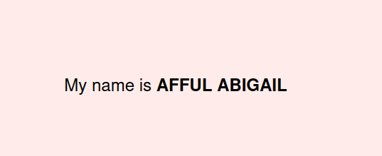

# rn-assignment2-11016236

 The task involves creating a React Native mobile application using Expo CLI. You'll start by setting up a blank template project and then modify the App.js file to customize its appearance and content. Specifically, you'll change the background color of a View component, display a customized text including your name, adjust the font size, and make your name bold. Throughout the task, it's important to commit your changes frequently to track your progress. Finally, you'll document your work in a README file, including a screenshot of the application and your student ID.

# STUDENT ID_11016236

# SCREENSHOT
